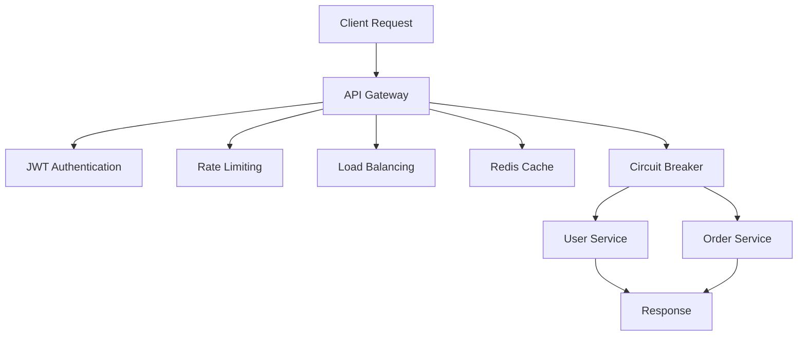

# Scalable API Gateway

A production-style API Gateway built with **FastAPI** and **Redis**, designed to route requests across multiple microservices while providing authentication, caching, rate limiting, load balancing, and fault tolerance.

---

## Overview

Modern applications often consist of multiple services that need a single, secure entry point. This project demonstrates how an API Gateway can act as the central layer between clients and backend services while improving performance, reliability, and maintainability.

The gateway handles:

* Request routing
* JWT authentication
* Rate limiting
* Redis caching
* Round-robin load balancing
* Circuit breaker fault tolerance

---

## Architecture



The API Gateway acts as a centralized entry point for all client requests. Before forwarding requests to backend services, it applies authentication, rate limiting, caching, and fault-tolerance mechanisms to improve security, performance, and reliability.

---

## Key Features

### JWT Authentication

Secures protected endpoints using JSON Web Tokens.

### Rate Limiting

Prevents abuse by restricting excessive requests from clients.

### Load Balancing

Distributes traffic across multiple service instances using a round-robin strategy.

### Redis Caching

Reduces repeated service calls and improves response latency for frequently accessed endpoints.

### Circuit Breaker

Prevents cascading failures by temporarily blocking requests to unhealthy services.

### Microservices Architecture

Demonstrates communication between independent backend services through a centralized gateway.

---

## Engineering Concepts Demonstrated

* API Gateway Pattern
* Microservices Communication
* JWT Authentication
* Redis Caching
* Load Balancing
* Rate Limiting
* Circuit Breaker Pattern
* Fault Tolerance
* Backend System Design

---

## Project Structure

```text
scalable-api-gateway/
│
├── gateway/
│   ├── main.py
│   ├── auth.py
│   ├── cache.py
│   ├── load_balancer.py
│   └── circuit_breaker.py
│
├── services/
│   ├── user_service.py
│   ├── user_service_2.py
│   └── order_service.py
│
├── requirements.txt
└── README.md
```

---

## Tech Stack

* Python
* FastAPI
* Redis
* JWT Authentication
* Docker (Redis)
* Uvicorn

---

## Running the Project

### 1. Install Dependencies

```bash
pip install -r requirements.txt
```

### 2. Start Redis

```bash
docker run -d -p 6379:6379 redis
```

### 3. Start Services

```bash
python -m uvicorn services.user_service:app --port 8001

python -m uvicorn services.user_service_2:app --port 8003

python -m uvicorn services.order_service:app --port 8002
```

### 4. Start API Gateway

```bash
python -m uvicorn gateway.main:app --port 8000
```

---

## Testing

Open:

```text
http://localhost:8000/docs
```

Steps:

1. Generate a JWT token using `/login`
2. Authorize using the generated token
3. Access protected endpoints
4. Observe request routing and caching behavior

---

## Design Decisions

### Why FastAPI?

Chosen for its high performance, automatic API documentation, and developer-friendly architecture.

### Why Redis?

Used for caching frequently accessed responses to reduce latency and improve throughput.

### Why Round-Robin Load Balancing?

Simple and effective strategy for distributing requests evenly across service instances.

### Why Circuit Breaker?

Prevents repeated calls to failing services and improves overall system resilience.

---

## What I Learned

* Designing an API Gateway architecture
* Implementing authentication and rate limiting
* Using Redis for performance optimization
* Applying load balancing strategies
* Building fault-tolerant backend systems
* Structuring scalable microservice-based applications

---

## Future Improvements

* Docker Compose setup for one-command deployment
* Service discovery
* API analytics and monitoring
* Distributed tracing
* Health checks and auto-recovery
* Kubernetes deployment

---

## Author

**Arcinth Siva**

CSE (AI & ML) | Software Engineering & AI/ML Projects
