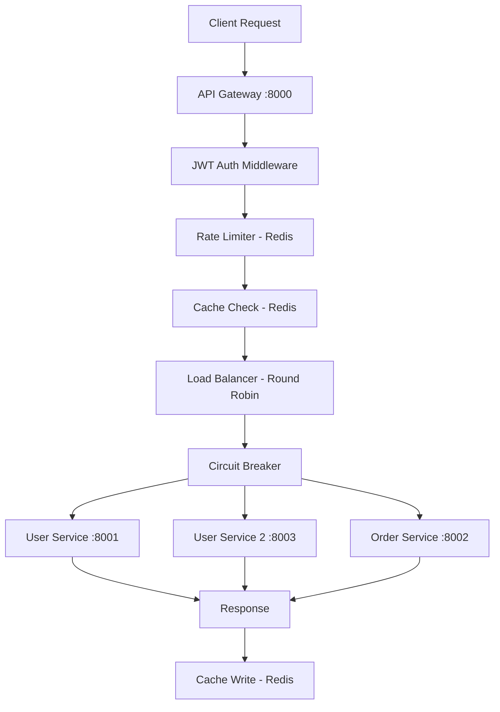

# Scalable API Gateway

A production-style API Gateway built with **FastAPI** and **Redis** that routes requests 
across microservices with JWT authentication, rate limiting, caching, load balancing, 
and circuit breaker fault tolerance.

---

## Architecture



The gateway is the single entry point for all client requests. Every request passes 
through auth → rate limiting → cache check → load balancing → circuit breaker 
before reaching a backend service. This layered approach means concerns are separated 
and each layer can be modified independently.

---

## What It Does

| Feature | Implementation | Why |
|---|---|---|
| Authentication | JWT middleware on protected routes | Stateless auth — no session store needed |
| Rate Limiting | Redis atomic INCR + TTL per client IP | Consistent across multiple gateway instances |
| Caching | Redis with configurable TTL per endpoint | Reduces backend load for read-heavy routes |
| Load Balancing | Round-robin across service instances | Simple, predictable distribution |
| Fault Tolerance | Circuit breaker per service | Prevents cascade failures to unhealthy services |

---

## Project Structure

```text
scalable-api-gateway/
│
├── gateway/
│   ├── middleware/          # Auth and rate limiting middleware
│   ├── utils/               # Shared utilities
│   ├── config.py            # Gateway configuration
│   ├── main.py              # Entry point
│   └── router.py            # Request routing logic
│
├── services/
│   ├── circuit_breaker.py   # Circuit breaker implementation
│   ├── user_service.py      # User service (instance 1) :8001
│   ├── user_service_2.py    # User service (instance 2) :8003
│   └── order_service.py     # Order service :8002
│
├── requirements.txt
└── README.md
```

---

## Setup

**Prerequisites:** Python 3.10+, Docker

**1. Install dependencies**
```bash
pip install -r requirements.txt
```

**2. Start Redis**
```bash
docker run -d -p 6379:6379 redis
```

**3. Start backend services**
```bash
python -m uvicorn services.user_service:app --port 8001
python -m uvicorn services.user_service_2:app --port 8003
python -m uvicorn services.order_service:app --port 8002
```

**4. Start the gateway**
```bash
python -m uvicorn gateway.main:app --port 8000
```

**5. Open API docs**
```
http://localhost:8000/docs
```
→ Generate a JWT token via `/login` → Authorize → Test protected endpoints

---

## Design Decisions

### Why Redis for both caching and rate limiting?

Two separate concerns, one infrastructure choice — intentional.

For **rate limiting**: an in-process counter would fail the moment you run two gateway instances — each instance would have an independent counter, meaning a client could send 2× the allowed requests by splitting traffic across instances. Redis atomic `INCR` with `EXPIRE` ensures the counter is shared across all instances, making rate limiting consistent regardless of horizontal scale.

For **caching**: same reason. In-process cache is per-instance — a cache miss on one instance doesn't benefit from a hit on another. Redis as a shared cache means any instance can serve a cached response, reducing backend load at the gateway level rather than per-process.

Single Redis instance handles both. Operationally simpler, and at this scale the trade-off is worth it.

---

### Why FastAPI over Flask?

Two reasons that actually mattered for this project:

First, FastAPI's async support. The gateway spends most of its time waiting — on Redis, on downstream services. Async handlers mean a single process can handle concurrent requests without blocking. Flask's synchronous model would require threads or a different WSGI setup to achieve the same.

Second, automatic OpenAPI docs. Every route is documented at `/docs` without additional code. For a gateway with multiple route patterns, this made development and testing significantly faster.

---

### Why round-robin load balancing?

Round-robin is stateless — no knowledge of service load, response times, or active connections required. For this project, where all service instances are identical and requests are roughly uniform, round-robin distributes load evenly without the complexity of weighted or least-connections balancing.

The trade-off: round-robin doesn't account for slow instances. One instance handling a slow request still receives the next request in rotation. For production, least-connections would be more appropriate. This is noted as a future improvement.

---

### Why a circuit breaker?

Without a circuit breaker, a failing downstream service causes every request to that service to hang until timeout — typically 30 seconds. Under load, this exhausts the gateway's connection pool and causes failures to cascade to other services.

The circuit breaker tracks failure rate per service. After a threshold of consecutive failures, it opens — immediately returning an error instead of attempting the call. After a cooldown period, it moves to half-open and tests if the service has recovered.

Result: a single failing service fails fast instead of degrading the entire gateway.

---

## Challenges and Trade-offs

**Stateless JWT vs session management** — JWT authentication means the gateway doesn't need a session store, but token revocation before expiry isn't possible without a token blacklist. For this project, short expiry times are the mitigation. In production, a Redis-based blacklist would be the right approach.

**Round-robin and slow instances** — discussed above. A slow instance continues receiving requests until the circuit breaker opens. Least-connections balancing would solve this at the cost of added complexity.

**Single Redis instance** — both caching and rate limiting depend on Redis availability. If Redis goes down, rate limiting fails open (requests are allowed through) and cache responses are unavailable, increasing load on backend services. A Redis Sentinel or Cluster setup would address this for production.

---

## Future Improvements

- Docker Compose for one-command startup of all services
- Prometheus metrics endpoint for request counts, latency, and error rates
- Distributed tracing with OpenTelemetry
- Service discovery instead of hardcoded service URLs
- Redis Sentinel for high availability
- Kubernetes deployment manifests

---

## Tech Stack

`Python` · `FastAPI` · `Redis` · `JWT` · `Docker` · `Uvicorn`
